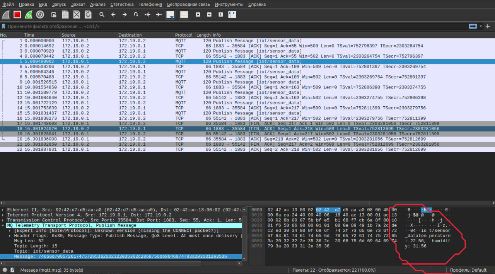
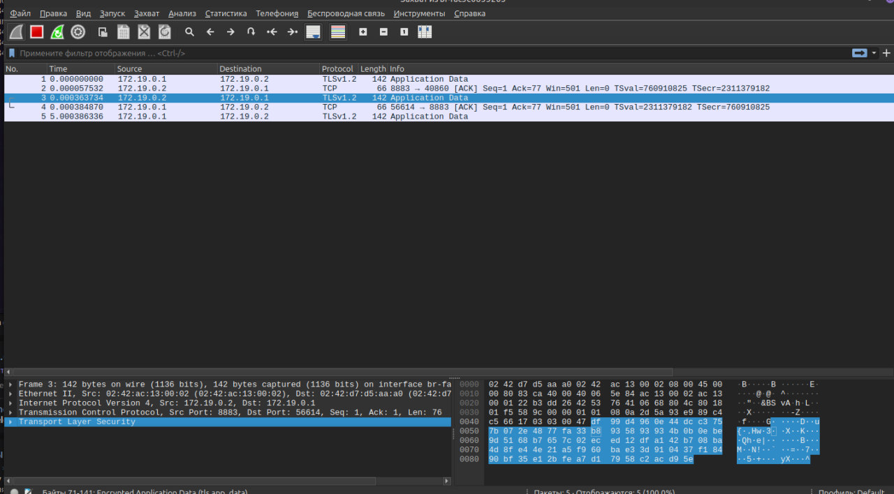

## Описание лабораторной работы для преподавателя

В рамках лабораторной работы студенту необходимо научиться анализировтаь исходный код (возможно на ранее неизвестном языке
программирования) клиент-сервера MQTT.

**Суть работы**: понять, что трафик обычного протокола MQTT не защищен. \
Студент должен запустить стенд, через программу Wireshark снять дампы трафика и понять, что 
данные передаются в открытом виде. Пример на рисунке ниже.

Далее студент должен проанализировать код: докерфайлы, конфигурационные файлы брокера, код программы.
Я сотавил закомментированные участки дял того, чтобы студент не искал реализацию Go, а мог 
сам раскомментировать и "включить" нужную реализацию безопасности. Лабораторная рабта принимает интерактивный вид.

Студенту необходимо включить использоване TLS при инициализации конфига для сервеар и клиена, 
поменять порт брокера с 1883 на 8883, благодаря этому ссылка приобретет вид с `tcp://ip:port` на `ssl://ip:port`, с 
помощью данных команд сгенерировать сертификаты и публичный ключ. 

Далее, перезаупстив систему, при правильной настройке, студент увидит в wireshark зашифрованный трафик.
На этом этапе практическая часть является выполеннной. 

!!! ОТДАВАТЬ ПРОЕКТ СТУДЕНТАМ НУЖНО БЕЗ `README_для_преподавателя.md` И ПАПКИ `img` !!!
